<div align="center">
  <a href="https://github.com/SafeRL-Lab/BenchNetRL">
     
  </a>
  
<h1 align="center" style="font-size: 30px;"><strong><em>BenchNetRL</em></strong>:  The Right Network for the Right RL Task</h1>


### 💻 [Code](https://github.com/SafeRL-Lab/BenchNetRL/tree/main) · 📄 [Paper](https://arxiv.org/abs/2505.15040) · 🚩 [Issues](https://github.com/SafeRL-Lab/BenchNetRL/issues)

</div>

 ---


<!--# Benchmarking Neural Networks in Reinforcement Learning (PPO)-->

## Directory Structure

```bash
BenchNetRL/
├── README.md               # This file
├── requirements.txt        # Python dependencies
├── env_utils.py            # Environment wrappers and creators
├── exp_utils.py            # Experiment argument parsing and logging utilities
├── gae.py                  # Generalized Advantage Estimation implementation
├── layers.py               # Neural network layer utilities and transformer modules
├── ppo.py                  # Vanilla PPO implementation
├── ppo_lstm.py             # PPO with LSTM / GRU recurrent policies
├── ppo_mamba.py            # PPO with Mamba / Mamba-2 recurrent SSM
├── ppo_trxl.py             # PPO with Transformer-XL (TrXL) / GTrXL memory
│
├── envs/                   # Custom environment implementations for quick memory tests
│   ├── poc_memory_env.py    # Proof-of-concept memory environment (PocMemoryEnv)
│   └── pom_env.py           # Proof-of-memory Gym environment (PoMEnv)
│
└── scripts/                # Baseline experiment scripts
    └── baselines/
        ├── atari.sh         # Atari benchmark commands
        ├── classic_control.sh # Classic control benchmark commands
        ├── minigrid.sh      # MiniGrid benchmark commands
        └── mujoco.sh        # MuJoCo benchmark commands
```

## ⚙️ Installation

Clone the repository:

```bash
git clone https://github.com/SafeRL-Lab/BenchNetRL.git
cd BenchNetRL
```

Create a Python environment (recommended using conda or virtualenv):

```bash
python -m venv venv
source venv/bin/activate  # on Linux/Mac
venv\Scripts\activate   # on Windows
```

Install dependencies:

```bash
pip install -r requirements.txt
```

### Ensuring CUDA Toolkit

Before installing CUDA-enabled PyTorch, make sure you have NVIDIA’s CUDA toolkit installed and your drivers up to date. You can download and install CUDA 12.4 from NVIDIA:

1. Visit the CUDA Toolkit Archive: https://developer.nvidia.com/cuda-toolkit-archive

2. Select CUDA Toolkit 12.4 for your operating system and follow the installation guide.

### Install Mamba/SSM library:

The Mamba and Mamba2 recurrent state-space models are required for ppo_mamba.py and ppo_mamba2.py. These modules are not included in this repository and must be installed separately. Ensure you are on a Linux system with a compatible CUDA version.

## Follow instructions from the Mamba repository to install Mamba:

```bash
git clone https://github.com/state-spaces/mamba.git
```

Note: Mamba requires Linux and specific CUDA drivers. Please refer to the Mamba repository for installation details and supported CUDA versions.

### Fixing PyTorch CUDA build issues

If you encounter an AttributeError related to torch.cuda.reset_peak_memory_stats, it means you have a CPU-only or incompatible PyTorch build. To resolve:

Uninstall any existing torch packages

```python
pip uninstall -y torch torchvision torchaudio
```

Reinstall CUDA-enabled PyTorch (matching your CUDA toolkit, e.g. 12.3):

```bash
pip install --index-url https://download.pytorch.org/whl/cu123 \
  torch torchvision torchaudio
```

Verify CUDA is available:

```bash
python - <<EOF

import torch
print("Torch version:", torch.version)
print("CUDA available:", torch.cuda.is_available())
EOF
```


**Optional guard in `ppo.py`**: in case some setups still miss the function, open `ppo.py` and replace:
```python
torch.cuda.reset_peak_memory_stats()
```

with:

```python
if torch.cuda.is_available() and hasattr(torch.cuda, "reset_peak_memory_stats"):
    torch.cuda.reset_peak_memory_stats()
```

## 🚀 Usage

### Running the Experiments

Use the provided scripts under `scripts/ours/` to launch our experiments. For example:

```bash
bash scripts/ours/atari.sh
```

### Running Custom Experiments

Example command for PPO + Mamba on Breakout:

```bash
python ppo_mamba.py \
  --gym-id ALE/Breakout-v5 \
  --total-timesteps 10000000 \
  --num-envs 16 \
  --num-minibatches 8 \
  --hidden-dim 450 \
  --expand 1 \
  --track \
  --wandb-project-name atari-bench \
  --exp-name ppo_mamba
```

Replace the script name (`ppo.py`, `ppo_lstm.py`, `ppo_mamba.py`, `ppo_trxl.py`) and flags as needed.

### File Descriptions

- env_utils.py: Wraps Gym environments with preprocessing such as frame stacking, masking, video recording.

- exp_utils.py: Command-line argument parsing and logging setup.

- gae.py: Advantage and return computation (GAE).

- layers.py: layer_init, attention modules, Transformer, SSM interfaces.

- ppo.py: Various PPO implementations (vanilla, LSTM/GRU, Mamba, Mamba2, Transformer-XL).

- envs/: Custom memory-focused Gym environments.

- scripts/ours/: Shell scripts for reproducible benchmarks.

## 📈 Performance Metrics - Average Across 9 Environments

### Architectures

- **PPO-1**: Standard PPO with **1-frame observation** (no frame stacking).
- **PPO-4**: PPO with **4-frame observation stacking** (temporal context via stacked frames).
- **LSTM, GRU, TrXL, GTrXL, Mamba, Mamba-2**: Sequence-based models with varying architectures to capture temporal dependencies in environment dynamics.


| Metric              | PPO-1 | PPO-4 | LSTM  | GRU   | TrXL   | GTrXL  | Mamba  | Mamba-2 |
|---------------------|-------|-------|-------|-------|--------|--------|--------|---------|
| **Steps Per Second** (↑)  | **3539** | _3305_ | 604   | 701   | 1856   | 1890   | 2734   | 2455    |
| **Training Time (min)** (↓)| **16.59** | _18.84_ | 121.90 | 91.04 | 30.33  | 29.42  | _21.20_ | 22.97   |
| **Inference Latency (ms)** (↓) | **0.856** | _0.899_ | 1.006  | 0.971  | 2.171  | 2.147  | 1.304  | 1.489   |
| **GPU Mem. Allocated (GB)** (↓) | **0.035** | _0.660_ | 0.194  | 0.194  | 1.765  | 1.330  | 0.217  | 0.219   |
| **GPU Mem. Reserved (GB)** (↓) | **0.327** | _0.983_ | 0.343  | 0.349  | 5.508  | 4.968  | 0.362  | 0.662   |

Below are key performance metrics visualized by architecture group.

### 🟦 PPO | 🟧 Classic Seq | 🟩 Transformers | 🟥 Mamba

<p align="center">
  <a href="plots/steps_per_second.png">
    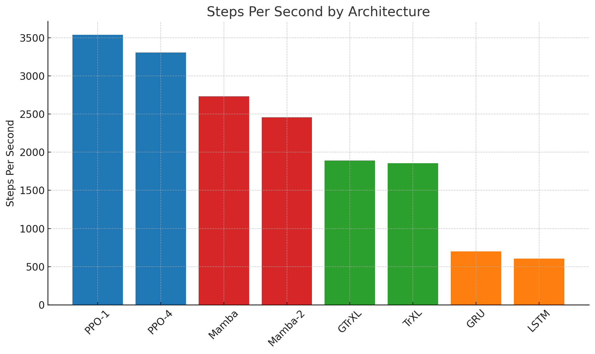
  </a>
  <a href="plots/training_time.png">
    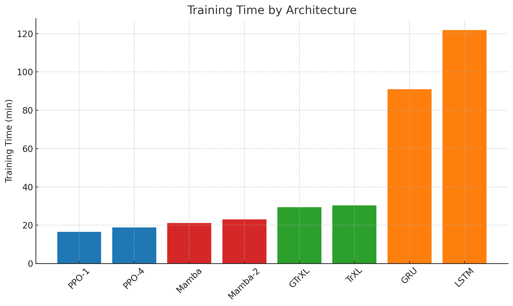
  </a>
  <a href="plots/inference_latency.png">
    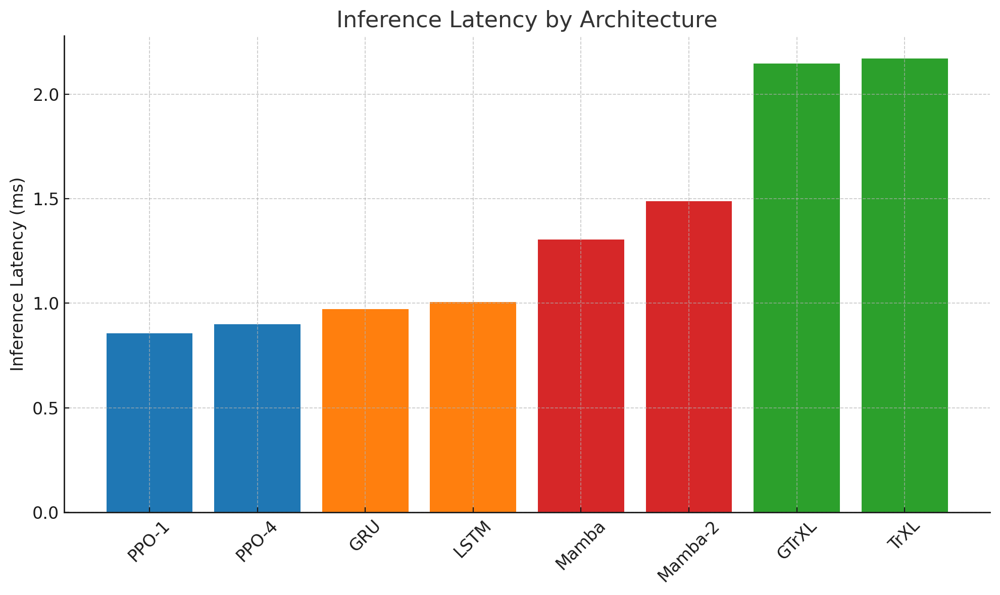
  </a>
  <a href="plots/gpu_memory_usage.png">
    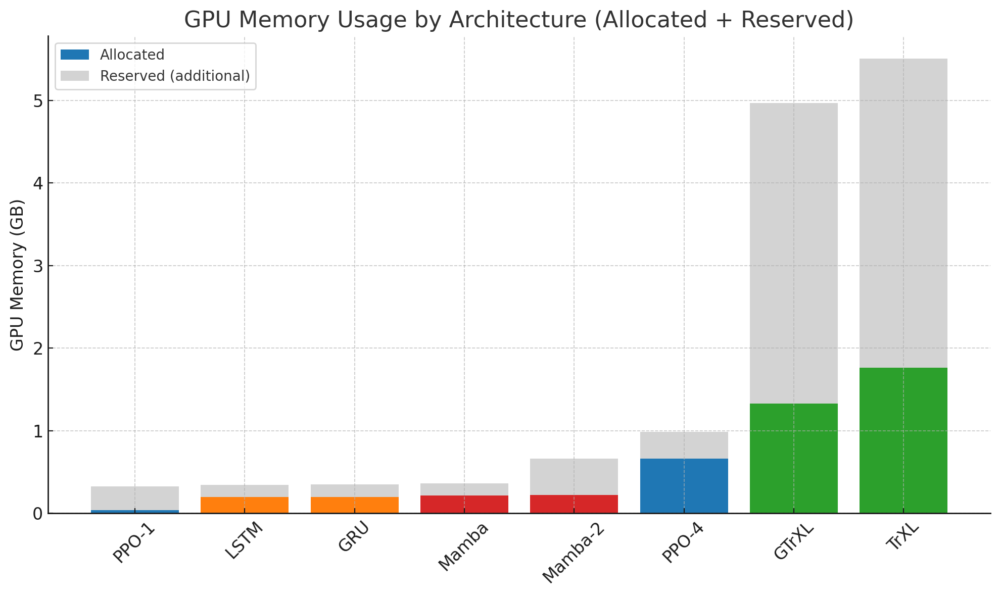
  </a>
</p>

📝 *Each architecture is color-coded by family for quick reference.*

## 📊 Results

### MuJoCo Environments
<p align="center">
  <a href="plots/walker.png">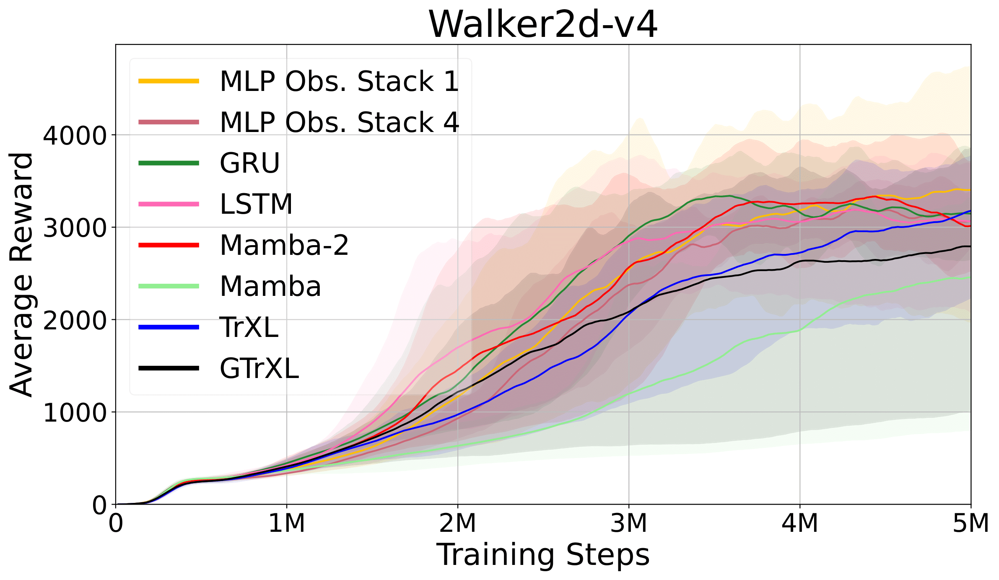</a>
  <a href="plots/hopper.png">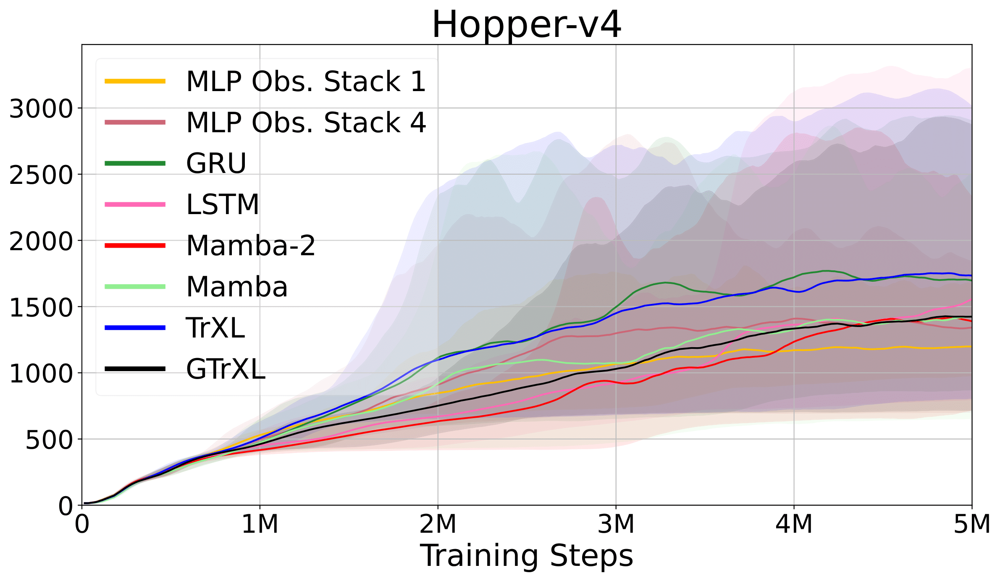</a>
  <a href="plots/halfcheetah.png">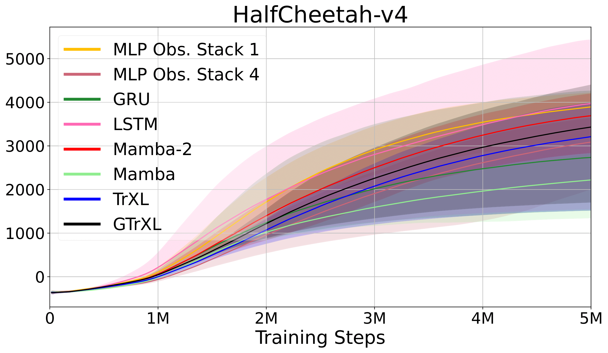</a>
</p>

---

### Atari Environments
<p align="center">
  <a href="plots/breakout.png">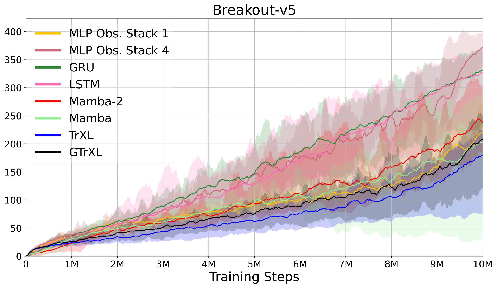</a>
  <a href="plots/pong.png">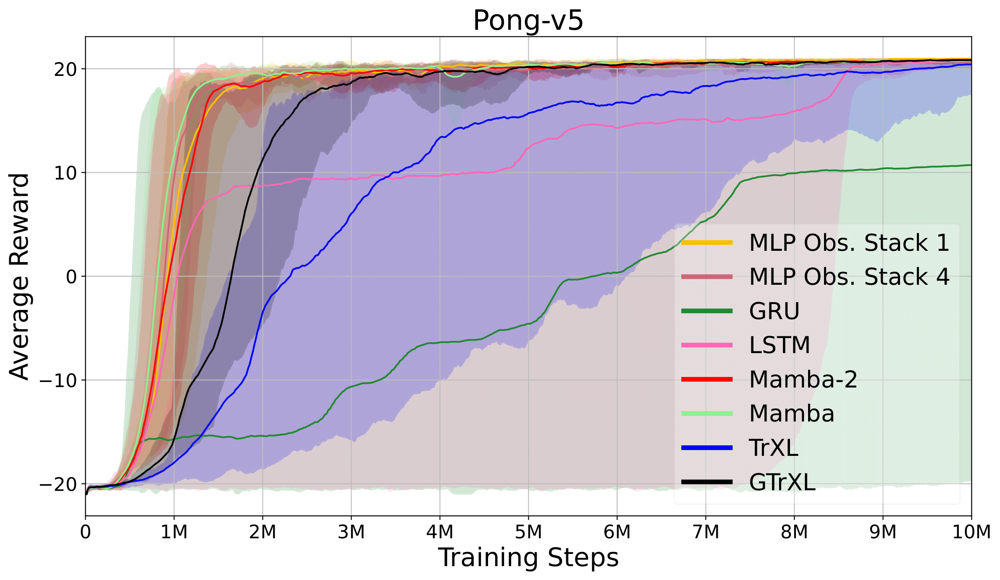</a>
</p>

---

### MiniGrid Environments
<p align="center">
  <a href="plots/doorkey.png">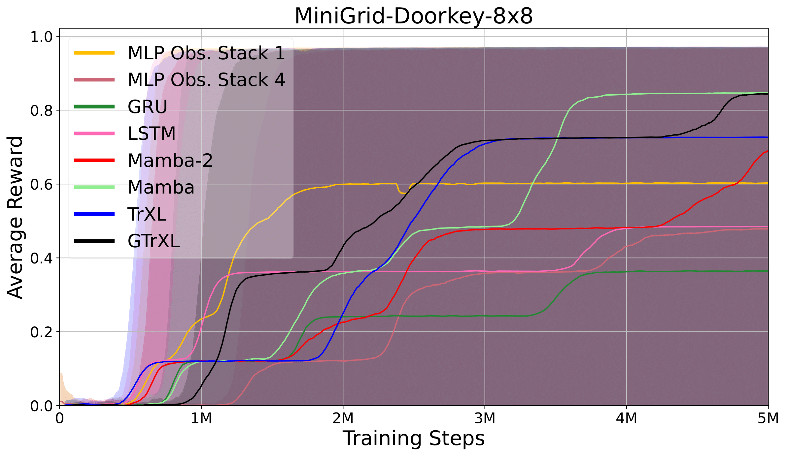</a>
  <a href="plots/memory.png">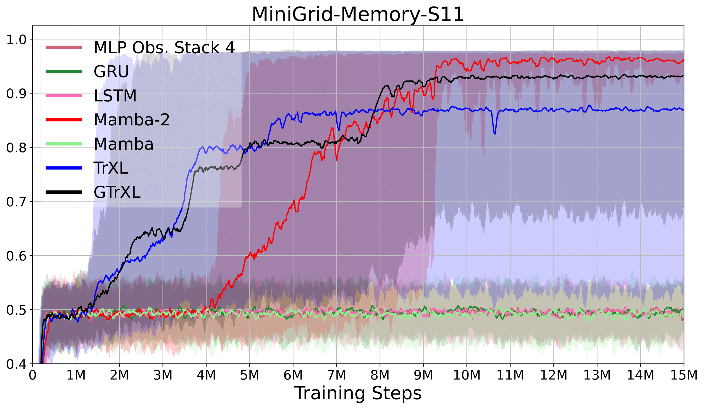</a>
</p>

---

### OpenAI Gym Environments
<p align="center">
  <a href="plots/cartpole.png">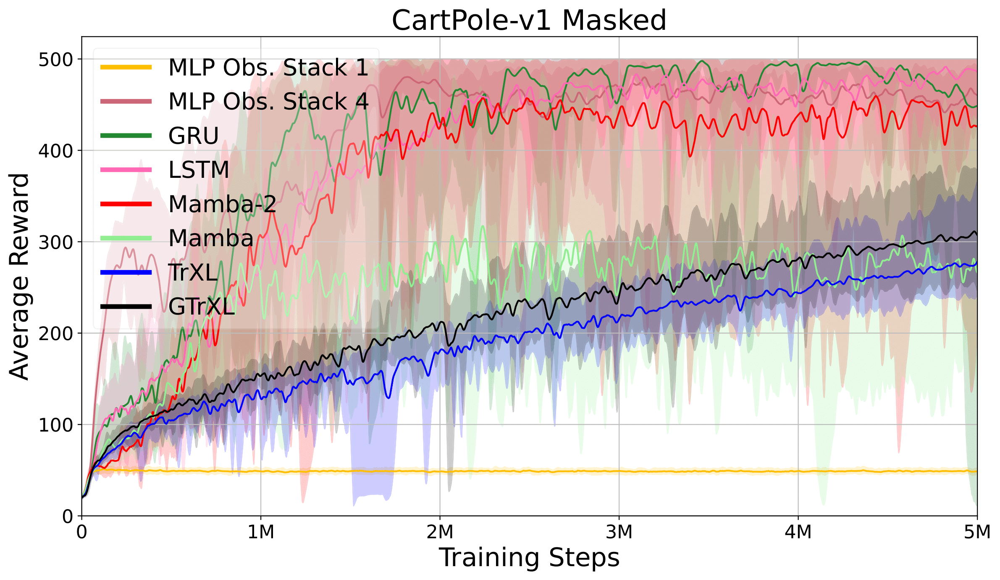</a>
  <a href="plots/lunarlander.png"></a>
</p>

---

## 📄 Citation
If you find the repository useful, please cite the study
``` Bash
@article{ivan2025benchnetrl,
  title={RLBenchNet: The Right Network for the Right Reinforcement Learning Task},
  author={Smirnov, Ivan and Gu, Shangding},
  journal={Arxiv},
  year={2025}
}
```
